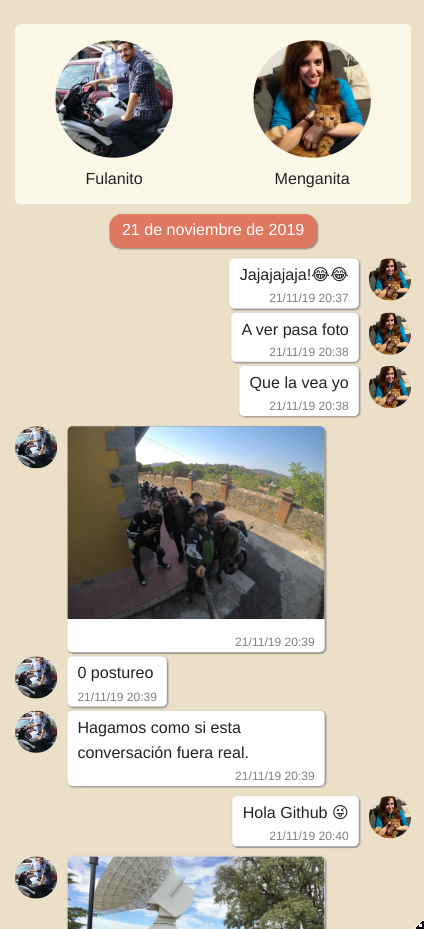

# Waev (WhatsApp Exports Viewer)

WhatsApp lets you export conversations in a format consisting on a plaintext file and its related
attachments. Waev parses that exports and renders them in a way very similar to the original
conversation. This way you can backup important conversations indefinitely, and review them from any
device.

## Totally real sample

## Internal export format

Each export (conversation) is a folder inside `exports_path` with the following structure:

    export1/
      chat.txt
      media/ (optional)

## Auto generated stuff left here for reference

To start your Phoenix server:

  * Install dependencies with `mix deps.get`
  * Install Node.js dependencies with `cd assets && npm install`
  * Start Phoenix endpoint with `mix phx.server`

Now you can visit [`localhost:4000`](http://localhost:4000) from your browser.

Ready to run in production? Please [check our deployment guides](https://hexdocs.pm/phoenix/deployment.html).

### Learn more

  * Official website: https://www.phoenixframework.org/
  * Guides: https://hexdocs.pm/phoenix/overview.html
  * Docs: https://hexdocs.pm/phoenix
  * Forum: https://elixirforum.com/c/phoenix-forum
  * Source: https://github.com/phoenixframework/phoenix
